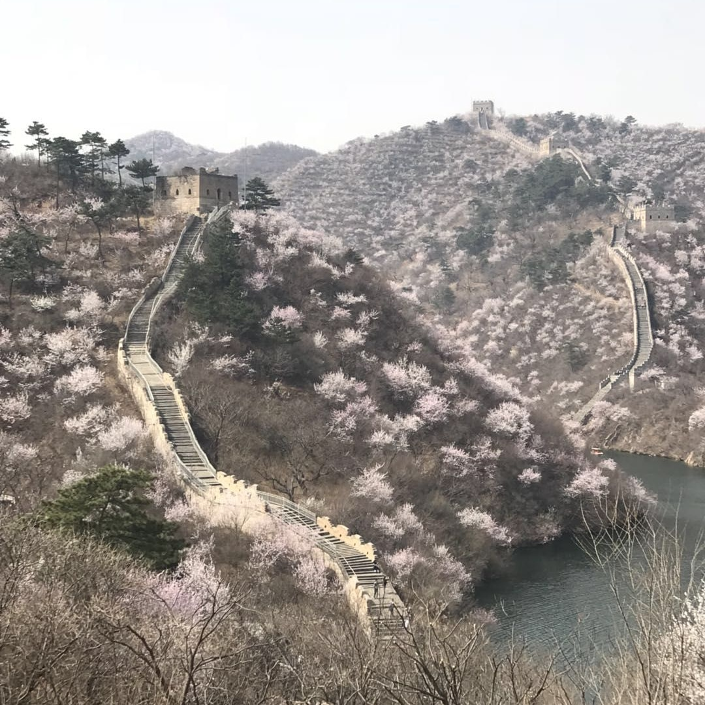

📍Saigon, Vietnam 

###### 11th November 2022

###### [x] words / [x] minute read

# Physical Presence Diversification 

“If voting made any difference, they wouldn't let us do it.” ― **Mark Twain**

**Vote with your feet**

I have never believed in the institute of voting, but I was broadly comfortable with the state of my home country for most of my life. At one point I even had enough faith in the insitutions and government to enlisted in the Army Reserve. When I was in highschool I did a school exchange to a town in the former East German Democratic Republic (DDR). At the time, the iron curtain and the Berlin wall were still fresh in the memories of people all across Europe. My German host parents imparted their experiences on to me over late night beers in the depth of the northern european winter. Their grievances - as I have since come to understand - were typical of the communist experience. Travel was highly regulated. Families were seperated for decades across a geopolitical fault lines, in their case - east and west germany. One could practically forget about leaving the country, and even travel within the Warsaw Pact countries and the USSR was difficult. People went missing, political opposition and dissenting opinions were suppressed. Shortages of basic goods from fruit to cars - where decade long waitlists persisted - were part of the standard experience. 

The thing that stuck with me the most was the inability to leave the country - an irony not lost on me after Australia's response to the pandemic made it illegal to leave the country. It is understandable that a country determine who enters its territory, but preventing it's own citizens from leaving is tyranical in every sense. People went to great lengths to leave the eastern bloc. From flying to swimming, to sneaking through forests or hiding in the trunk of cars. When visiting the Baltic coast in north-east Germany and dipping my toes in the freezing water, I remarked on the futility of attempting to swim to Sweden. To that my German host mother remarked in German, "We don't know what these people went through". Escape at any cost, which victims of the state could rationalise on account of their suffering so that even a high probability of death was no deterrent. To resist such a cruel society is honourable, to avoid it altogether is preferable. 

At the end of WW2, as the Red Army pushed through Germany towards Berlin, millions of ethnic German refugees fled west. Many died, those who didn't were often displaced. The lucky ones were simply trapped, and would later become citizens of the German Democratic Republic on October 7th, 1949. While the decision to leave would have been heartbraking, hindsight was kinder to those who boldy left. The Iron Curtain fell across Europe. Not long after, the Korean War was fought to a bloody armistice. POWs were lined up at the demarkation line, and given the choice. In the words of No Kum Sok, those who decided to stay in the north "deserved their fate".

**Our society**

The modern, US modeled system is far more sophisticated in its surveillance techniques and efficiency than were the Warsaw Pact nations. Modern technologies allow for this. It is also a less overtly cruel system, until it needs to be. Governments can be voted in or out, but the prevailing direction remains unchanged. Things can be questioned, as long as those questions are not based in the truth, else they be censored, not by a sluggish state apparatus, but rather a sophisticated web of crony capitalist tech monopolies and a collusive media machine. Until the last two years, control was exercised softly. But in the words of Mao Zedong, "political power grows from the barrel of a gun". 

In this sense, while the parody that is democratic governance plays out debates on meaningless and insignificant decisions, the narrative around anything that threatens the power of the state is actively surpressed. Much more than surpressed and censored though, a state of mass psychosis prevails in the West, meaning any opinion that deviates from the prevailing narrative is effectively self-censored by the society itself from within. 

Recently in Sydney I sat down with a friend who exclaimed that "recent studies and literature has shown that Australia's COVID response was too extreme". Nothing better sums up western democracy than pursing a disastrous policy at any cost, and with no consideration given to alternative views, only to later admit that "mistakes were made". Knowing however that this is the modus operandi of the legacy west, it became more than apparant that the most effective strategy is to vote with ones feet. 

I have been fortunate to live in many different countries and a variety of systems. Islamic countries, officially communist countries, monarchies, parliamentary democracies. A common misconception is that only western democracies have freedoms. But just because certain rights are not enshrined in any official document does not mean they do not exist. In fact, the presence of any legal rights is often evidence that such rights do not exist in practice. A westerner will not understand that a Beijing cab-driver will talk to you about all matter of topics, and is often eager to, because from their perspective no such discussion legally exists in China. Conversely, westerners walk on egg shells around each other, worried about making offence, and yet their right to freedom of expression is supposedly - often - enshrined. The difficulty for most people is that they do not know where the delineation lies, because they are unfamiliar with the rules and the rules are often not written. 

In the emerging geopolitical shift that is dividing the world in two, I have formulated my own strategy for tyrannical government avoidance. Rather than formulate a strategy based only upon official laws in each country, I have rather also given significant weight to my own understanding and experiences of certain systems wherein for example laws may exist, but are rarely enforced, or can be easily circumvented, in a sense allowing some of us to live above them. Furthermore, I have given great consideration to the example provided in the last two years, which provided insights into how governments may react to future crises - whether manufactured or real. 

**Thailand**

**Mexico**

**Italy**

**Georgia**

