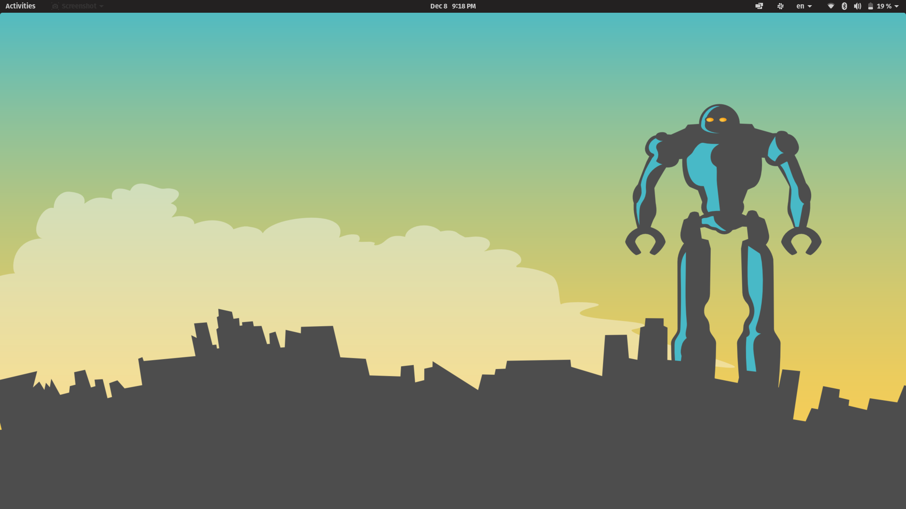

# You need to try Pop!_OS

###### 09 December 2020

###### 467 words / 2 minute read

*A standard Pop!_OS 20.10 background on my XMG Fusion 15*

Ever since I can remember I have been an Apple hater. Every attempt to help my mother with something on her iMac left me in an entirely irrational state of all encompassing frustration. Where is the right click? Why has it looked the same since I was 5 years old? Of course Apple is an undeniably great company. The market may well often be wrong, but Apple's $1 trillion valuation - approximately the equal to the DAX 30 at the time of writing - is impossible to deny, even for the most astute doubter of the efficient market hypothesis. In fact mac plaudits unabashedly allude to the inherent usability of the eco-system, operating system and hardware design in any good Apple debate. Frankly, they are right. Steve Jobs was a sick puppy, but he was also, without a shred of doubt, a user experience maestro.

But what if you are one of the few people who just doesn't get it? What if, like me, when the whole room agrees that iPhone's 'just make sense' you shudder with righteous indignation? What if I told you there was a pill - not windows, it warrants not a mention - so sweet, so liberating and yet so stable and so robust, that you never had to entertain such a debate again. Let me introduce to you, without further ado, **[Pop!_OS by System76](https://pop.system76.com/)**. A free, open-source linux distribution based on Ubuntu. Pop!_OS features a custom GNOME graphical user interface, out-of-the-box disk encryption and robust power management tooling. The best part is that you don't need to be a serial linux distro hopper to understand why Pop is good. You just need to use it. 

Pop!_OS's sleek animations, tasteful colour scheme and dependability make it the perfect daily driver for any self-respecting software engineer. While my heart tells me to use Arch, the sheer reliability of this distribution makes the decision clear beyond question. If you're anything like me you prefer the bolt on nature of Flask to Django, Koa to Express, well Pop comes void of many apps that are pre-installed with Ubuntu, and yet not to the detriment of practicality. Of course, if you need anything, the Pop!\_Shop is readily at your disposal. 

If you rarely fit in, if you're a contrarian creature who places freedom above conformity - but still have to produce code - then this might just be the operating system for you. I've run it on the Huawei Matebook X Pro, Lenovo T440p and my XMG Fusion 15. Without a doubt it is the smoothest, most reliable, best looking daily driver that I have tested, and I don't plan on moving anytime soon.

 
